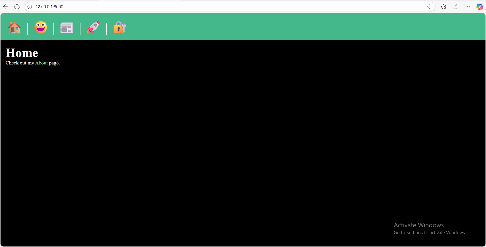
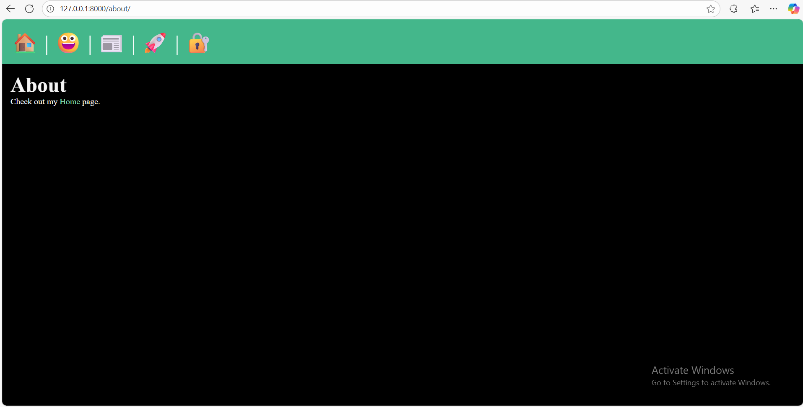
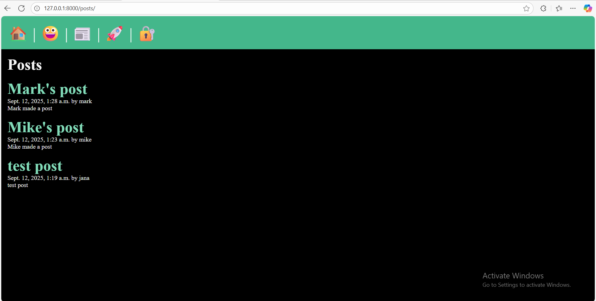
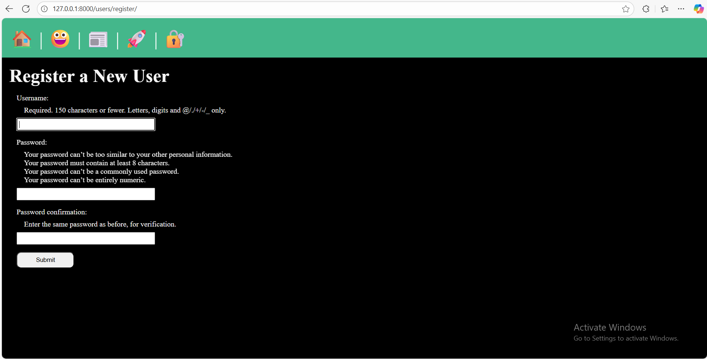
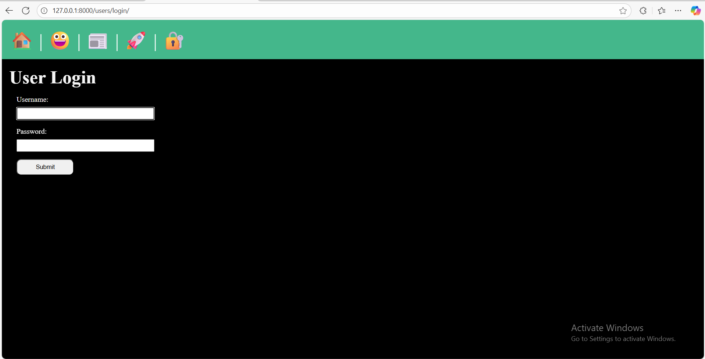
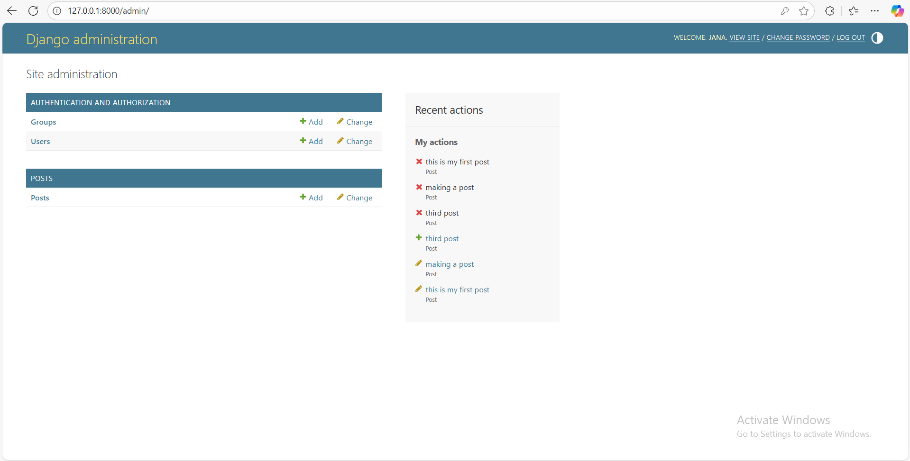
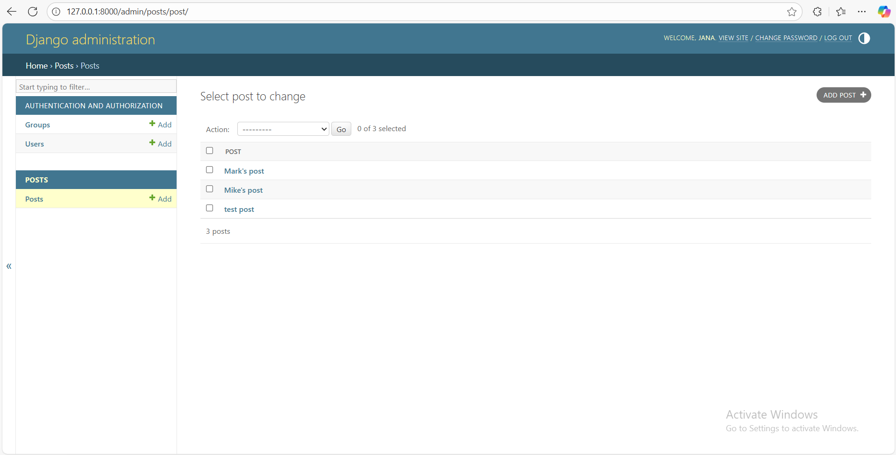
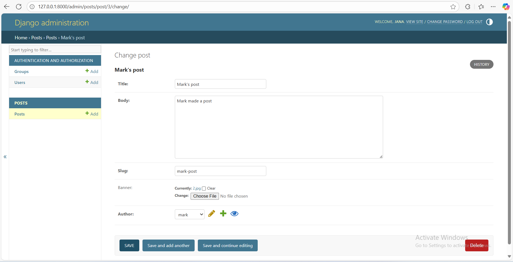
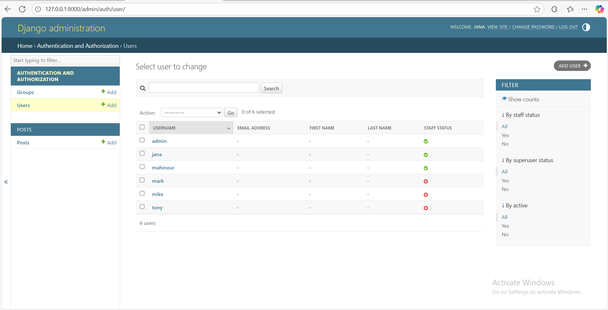

# ITI Final Project – Django Blog-like Web App

A small **Django web application** built as part of the ITI Final Project.  
It provides a homepage and about page, lets visitors browse posts (list + detail), supports image uploads, and includes a user system for registration/login.

---

## 📖 Table of Contents
- [About](#about)
- [Features](#features)
- [Project Structure](#project-structure)
- [Routing & Views](#routing--views)
- [Templates & Layout](#templates--layout)
- [Models & Media](#models--media)
- [Data Flow](#data-flow)
- [Installation & Setup](#installation--setup)
- [Recommendations](#recommendations)
- [How app looks likes](#How-apps-looks-like)

---

## 🔎 About
This project is a **mini blog-like platform** that demonstrates:
- Django project/app structure
- User authentication (register, login)
- Working with models, templates, and static/media files
- Basic CRUD-like functionality (list + detail views for posts)

---

## ✨ Features
- Homepage and about page
- Post listing and individual post detail pages
- Each post can include:
  - Title
  - Date
  - Body text
  - Banner image
- User registration and login system
- Media upload and serving in development
- Organized layout and reusable base template

---

## 📂 Project Structure

```

ITI\_Final\_Project\_Using\_Django/
│── manage.py
│── db.sqlite3
│
├── MyProject/              # Main project config
│   ├── settings.py
│   ├── urls.py
│   ├── views.py
│   ├── wsgi.py
│   └── asgi.py
│
├── posts/                  # Posts app
│   ├── models.py           # Post model
│   ├── views.py            # List + detail views
│   ├── urls.py
│   └── templates/posts/
│       ├── posts\_list.html
│       └── post\_page.html
│
├── users/                  # Users app (registration/login)
│   ├── views.py
│   ├── urls.py
│   └── templates/users/
│       └── register.html
│
├── templates/              # Project-level templates
│   ├── layout.html         # Base template
│   ├── home.html
│   └── about.html
│
├── static/                 # Static assets
│   ├── css/style.css
│   └── js/main.js
│
└── media/                  # Uploaded post images
└── 1.jpg ...

````

---

## 🔀 Routing & Views

### Project `urls.py`
- `/` → `homepage` → renders `templates/home.html`
- `/about/` → `about` → renders `templates/about.html`
- `/posts/` → includes `posts.urls` (post list + detail)
- `/users/` → includes `users.urls` (registration/login)
- `MEDIA_URL` → serves uploaded images in dev mode

### `posts.views`
- `posts_list` → queries all posts ordered by date → renders `posts_list.html`
- `post_page(slug)` → gets a post by slug → renders `post_page.html`  
  ⚠️ Currently uses `Post.objects.get(slug=slug)` which raises a 500 if not found.  
  ✅ Should use `get_object_or_404(Post, slug=slug)`.

---

## 🎨 Templates & Layout

- **`layout.html`** → Base template  
  - Loads static files ``
  - Provides navigation (links to posts, users, etc.)
  - Uses `` for dynamic routing
- **Post templates** → Extend layout and display:
  - `post.title`
  - `post.date`
  - `post.body`
  - `post.banner.url`

---
## How apps looks like

### Home Page 


### About Page


### Posts Page



### Register Page


### Login Page


### admin Page






---

## 🖼️ Models & Media

- `Post` model:
  - Title, body, date, slug, banner image
- Images uploaded into `/media/`
- Configured in `settings.py` + `urls.py` to serve during development
- Template usage:
  ```django
  
  ```

## 🔄 Data Flow

1. Browser request →
2. URL matched in `urls.py` →
3. View function called →
4. Database queried →
5. Template rendered (with `layout.html` + page-specific content) →
6. Response sent to browser →
7. Static & media files served from `/static/` and `/media/`

---

## ⚙️ Installation & Setup

1. **Clone the repository**

   ```bash
   git clone https://github.com/ahmedta004/ITI_Final_Project_Using_Django.git
   cd ITI_Final_Project_Using_Django
   ```

2. **Create a virtual environment**

   ```bash
   python -m venv venv
   source venv/bin/activate   # Linux/Mac
   venv\Scripts\activate      # Windows
   ```

3. **Install dependencies**

   ```bash
   pip install -r requirements.txt
   ```

4. **Run migrations**

   ```bash
   python manage.py migrate
   ```

5. **Create a superuser (optional)**

   ```bash
   python manage.py createsuperuser
   ```

6. **Start the development server**

   ```bash
   python manage.py runserver
   ```

7. Open [http://127.0.0.1:8000](http://127.0.0.1:8000) in your browser.

---

## 🛠️ Recommendations

* Replace `Post.objects.get(slug=slug)` with `get_object_or_404` in `post_page`.
* Ensure `posts/urls.py` defines:

  ```python
  app_name = 'posts'
  ```

  with named routes (`list`, `page`).
* Confirm `users/urls.py` includes a `'register'` named route (required by `layout.html`).
* Use Django’s built-in `LoginView`, `LogoutView`, and `Signup` patterns for more robust user handling.

---

## 📌 License

This project is created as part of **ITI Training**.
You may adapt or extend it for learning purposes.

```

---
